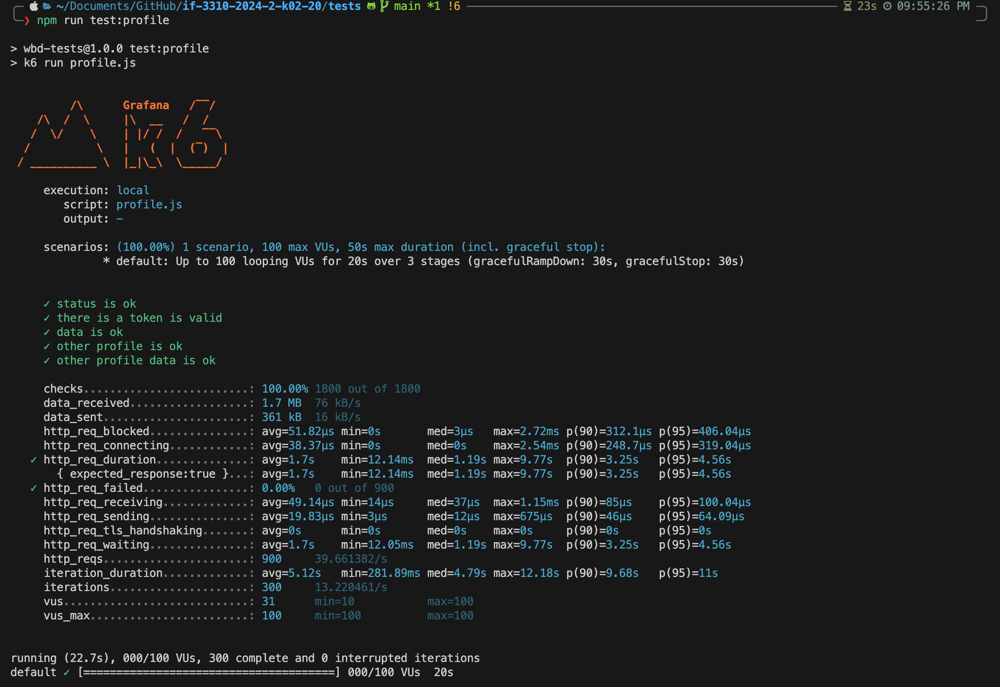
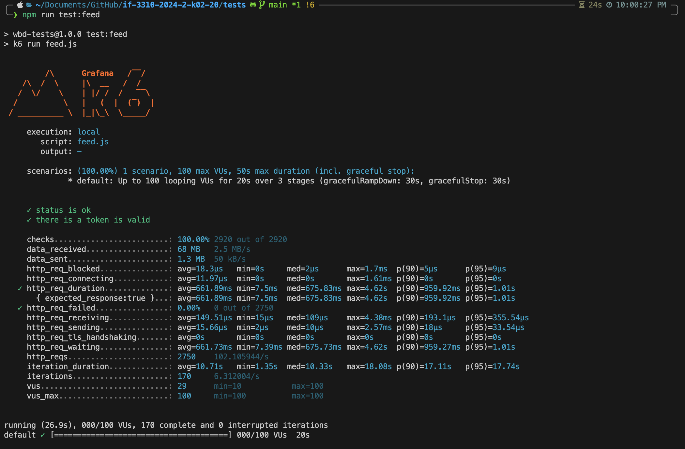
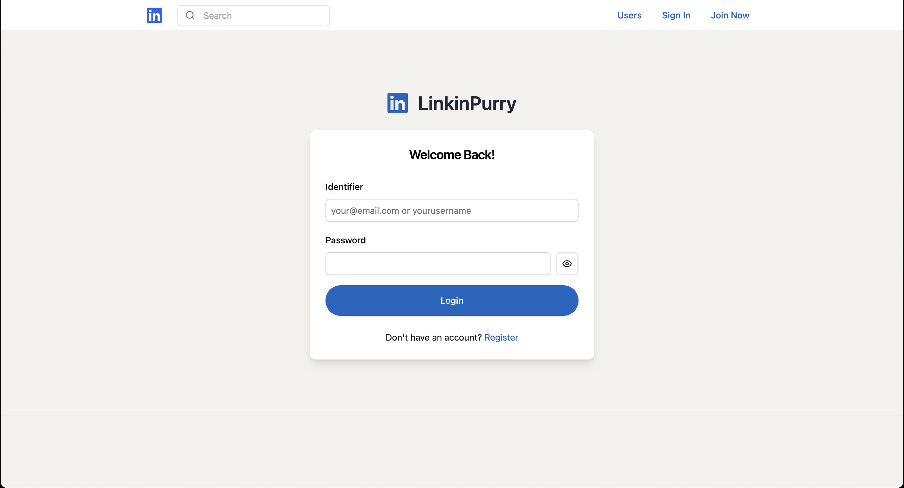
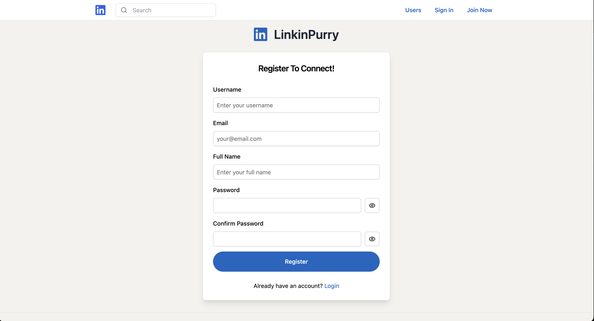
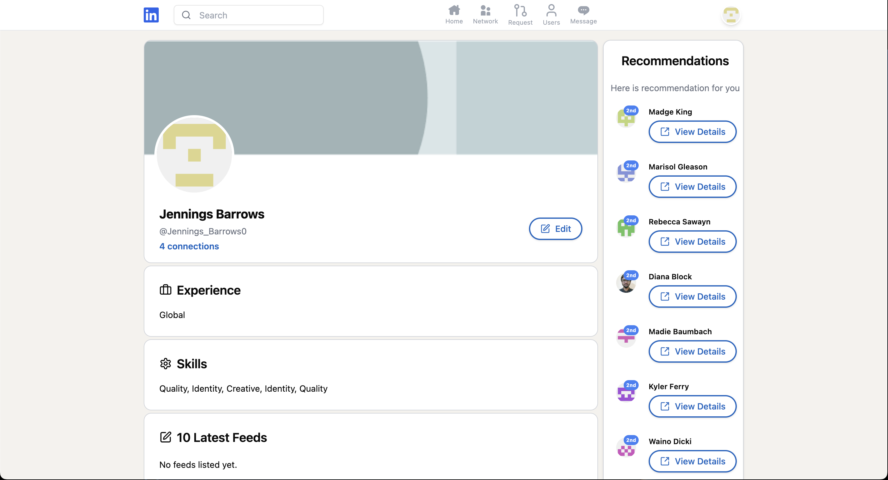
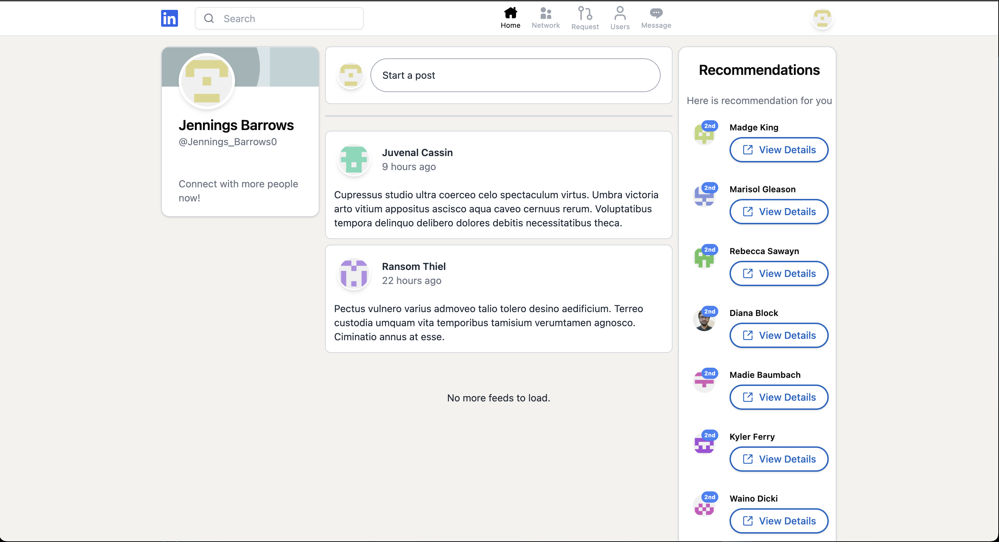
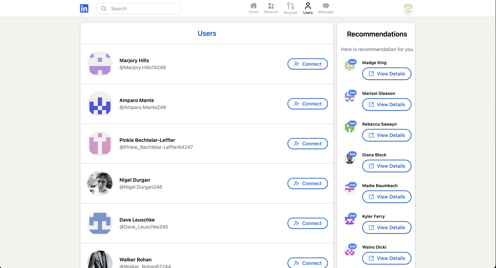
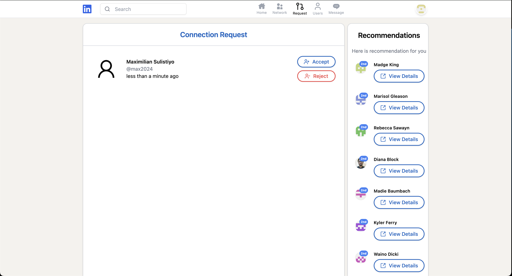
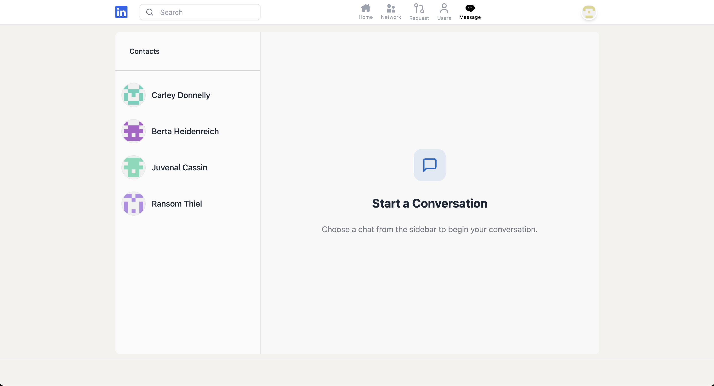

# Milestone 2 IF3110 Pengembangan Aplikasi Web
> In this milestone of the project we are making an SPA of linkedInPurry

## Table of Contents
- [Milestone 2 IF3110 Pengembangan Aplikasi Web](#milestone-2-if3110-pengembangan-aplikasi-web)
  - [Table of Contents](#table-of-contents)
  - [General Information](#general-information)
  - [Technologies Used](#technologies-used)
  - [Features](#features)
  - [Screenshots](#screenshots)
    - [Profile Test](#profile-test)
    - [Feed Test](#feed-test)
    - [Login](#login)
    - [Register](#register)
    - [Profile](#profile)
    - [Feed](#feed)
    - [Users](#users)
    - [Connection Request](#connection-request)
    - [Chat](#chat)
  - [Setup](#setup)
  - [Usage](#usage)
  - [Acknowledgements](#acknowledgements)
  - [Team Responsibilities](#team-responsibilities)
  - [Contributor](#contributor)

## General Information
- Single Page Application for linkedInPurry that have feeds, connections, and chats feature

## Technologies Used
- Express.js
- React.js
- TanStack
- Docker

## Features
- Feeds
- Connections
- Push Notification
- Profiles
- Chats

## Screenshots

### Profile Test

### Feed Test

### Login

### Register

### Profile

### Feed

### Users

### Connection Request

### Chat

## Setup
Make sure you have docker desktop installed in your device and also make sure that the .env file is filled

## Usage
To use it simply write this in the terminal

`docker compose up --build -d`

## Acknowledgements
- Pa Yudistra for giving us the materials for this subject
- Thanks to IF3110 Asisstant for making the specifications and helping us build this through QnA along the way
- Thanks to SBD, Jarkom, and AI for delaying the deadlines so that we can finish this project

## Team Responsibilities
| **Side**        | **Page/Functionalities**   | **NIM**  |
| --------------- | -------------------------- | -------- |
| **Server-side** | Halaman Login              | 13522114 |
|                 | Halaman Register           | 13522114 |
|                 | Halaman Profil             | 13522116 |
|                 | Halaman Feed               | 13522061 |
|                 | Halaman Daftar Pengguna    | 13522116 |
|                 | Halaman Permintaan Koneksi | 13522116 |
|                 | Halaman Chat               | 13522114 |
|                 | Notifikasi                 | 13522061 |
| **Client-side** | Halaman Login              | 13522114 |
|                 | Halaman Register           | 13522114 |
|                 | Halaman Profil             | 13522116 |
|                 | Halaman Feed               | 13522061 |
|                 | Halaman Daftar Pengguna    | 13522116 |
|                 | Halaman Permintaan Koneksi | 13522116 |
|                 | Halaman Chat               | 13522114 |
|                 | Notifikasi                 | 13522061 |

## Contributor
| NIM      |            Nama            |
| :------- | :------------------------: |
| 13522061 |    Maximilian Sulistiyo    |
| 13522114 | Muhammad Dava Fathurrahman |
| 13522116 |        Naufal Adnan        |